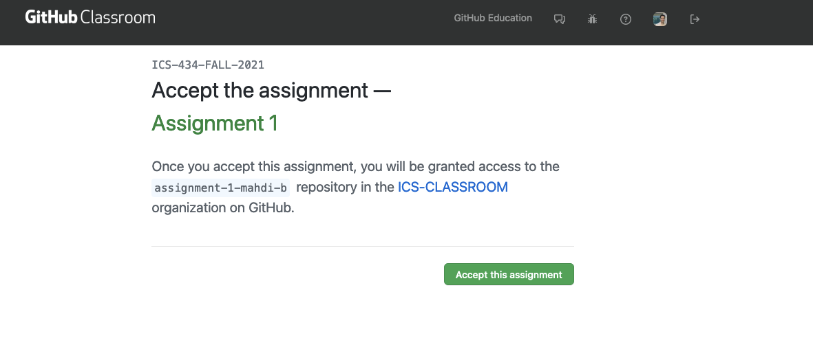

### Assignment 2: Analyzing large datasets with Spark.

* This assignment is due on 11/8/2021. Your assignment will be automatically pulled from the GitHub account it was cloned to at 11:59 PM. GitHub Classroom will show the correct date but may show a different time.

Please follow the instruction below to clone the assignment into your GitHub account. If you don’t already have a GitHub account, you will need to create one first. Navigate to the GitHub assignment page located at the following URL:

https://classroom.github.com/a/l0H7egxx

* You should see a message prompting you to authorize "GitHub Classroom" to access your account.
  * Click “Authorize github” to continue.

* By accepting the assignment, GitHub will clone the assignment repository in your account. The repository name should have the following name structure: assignment-1-XYZ , where XYZ you GitHub username. After the process completes, you will receive a message informing you that your assignment repository has been created.

In summary, the sequence of screen you'll see is similar to the following

1. Accept the assignment

2. Repo being created. Referesh occasioanlly to get screen 3

3. You're ready to go

* Clone the repo to work on the assignment locally (on your machine) and push your work on a regular basis to save your progress.

* TAs will monitor GitHub progress and will decline to help if no work has been pushed to GitHub before 11/05 